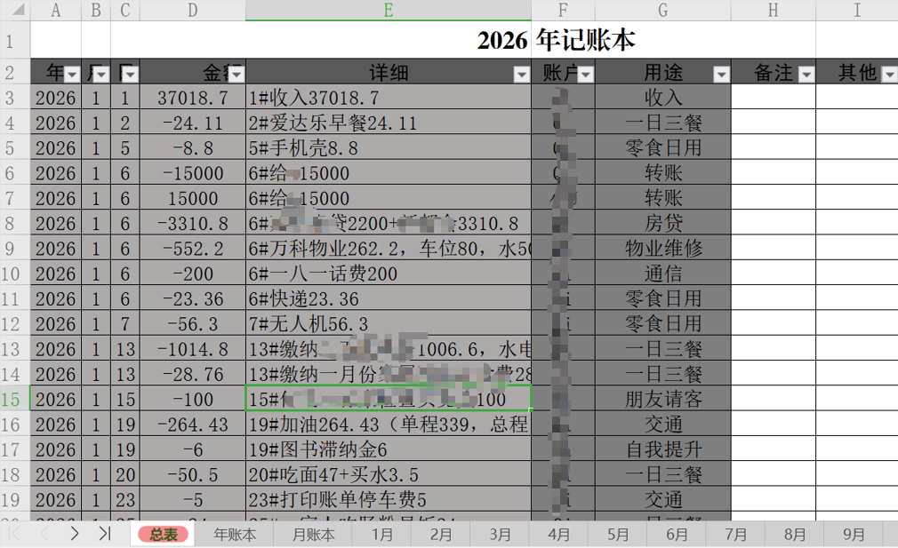
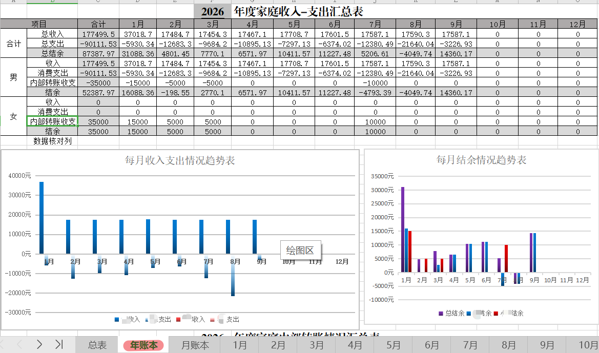
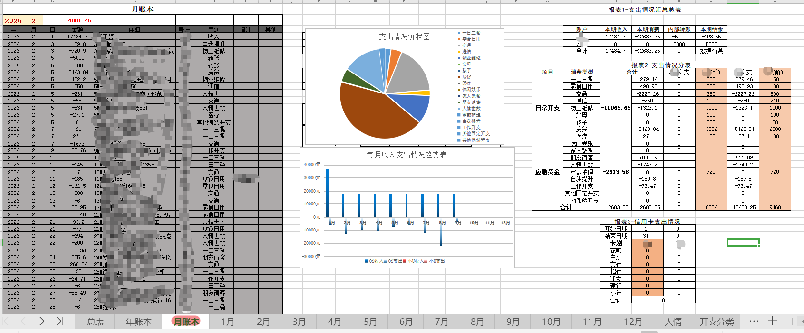
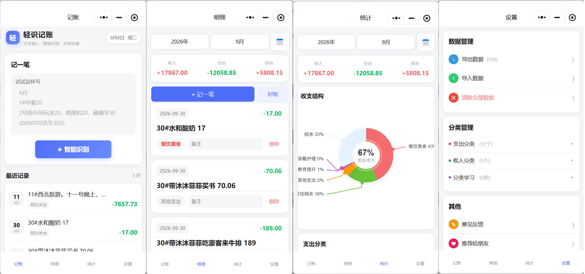

# 我把全家记账做成了一条流水线：手机记事本随手记，Excel 自动出全家报表

> 记账这件事，坚持比工具重要；而让坚持变得毫不费力，是工具唯一该做的事。

如果把记账工具拉出来比一场，赢的从来不是功能最全的那个，而是你愿意天天打开的那个。

这句话，是我折腾了五年、换过五六种记账方式之后，最想说的一句。今天写这篇文章，是因为我最近终于把自家的记账流程彻底理顺了——从手机随手记，到电脑自动汇总，再到全家一起看，每一步都不打架。顺手还把这套账本做成了"清掉隐私数据就能直接用"的模板，想完整讲一遍这套流程：既是记录，也算给模板写一份说明书。

---

## 一、记账这件事，大多数人败给的不是懒

市面上的记账软件有几百款，可能坚持超过三个月的家庭，真的不多。

原因不是懒。我这些年反复琢磨，真正的原因是**记录成本太高**：打开 App、找分类、选账户、输金额、再打个标签，一笔账三十秒起步。三十秒不长，但一个月三十笔就是一刻钟，一年就是三个小时。人都是有惰性的——任何需要"专门打开一个东西"才能记的动作，迟早会被跳过。

等到月底想补账，更痛苦：想不起某笔钱花在哪、分类对不上、金额记错……补账比记账还折磨，于是干脆放弃。

所以我家的记账，从一开始就立了一条规矩：**记录和整理，必须分开。**当场只记最便宜的一行字，费脑子的归类、汇总、分析，统统留到月底一次做完。

## 二、手机记事本：我家的"随手记"

我们家现在记流水，用的就是手机自带的记事本——不是任何一款记账软件。

谁花的钱谁记，想起来了就掏手机写一行：

> `1#早饭豆浆油条12`　`5#孩子买书35`　`给妈转1000`　——几号、花了啥、多少钱，一句话说清

这一行字有多便宜？点亮屏幕、打开记事本、打完字、锁屏，五秒钟。地铁上、菜摊前、加油站，什么时候都能记——没有分类、没有账户、没有心理负担。我和家属都这么记，月底打开记事本一看，一个月的"证据"整整齐齐躺在里面。

这个习惯用了两年多几乎没断过，因为**"记"这个动作便宜到可以忽略不计**。

顺带说一句：开头带编号（`1#`）是我很早以前定的格式，用来对账定位；后来发现没有编号的纯文字一样能被识别，所以现在大家怎么写都行，**编号可有可无**。

## 三、月底十分钟：一行行文字，怎么变成账本

随手记的爽，要在月底兑现。过去我手工誊抄，几十行要抄小半天还容易错位；现在整段交给机器：

**把记事本里攒的流水一次性贴进去，日期、金额、分类自动拆好。**走哪条路都行——我自己开发的「轻识记账」小程序能识别，把文字丢给 AI 也能识别。识别完的账单一行行进 Excel 的"流水表"，只记录、不加工，全年数据都沉淀在这一张表里。

Excel 这边连最麻烦的"这一行字里到底有几个金额"都是自动算的：贴一句 `买菜35.5，水果12`，金额列自己就出 47.5，不用你心算好再填。要实现这一点，我在表里藏了一个看不见的"计算引擎"，把文字逐字扫描、把数字挑出来累加——懂表格的人会心一笑，不懂的也不用管，**你只负责贴文字**。

*▲ 流水表是全家的数据中枢：识别出的账单按"年 / 月 / 日 / 金额 / 详细 / 账户 / 用途 / 备注"一行行入库，表头带筛选，只记录、不加工*

## 四、全家一张表：男主女主分开记，又能合起来看

家庭记账最大的坑，往往不是记不住，而是"两个人的账怎么算"。合在一起看吧，谁花多花少说不清；彻底分开吧，家庭整体收支又没数。

我的解法是：流水表里加一列"账户"，记下这笔钱是谁花的——男主、女主，还是转给对方。这样**每个人自己的开销清清楚楚，家庭的总体盘子又在同一张表里**，想拆能拆、想合能合。

到了年账本，这个设计就舒展开了：按月铺开 12 列，每列再分男主、女主两栏，谁挣了多少、谁花了多少，全年一屏看完。

更关键的是，我专门给夫妻之间"转来转去的钱"设计了**内部转账对账**：我转给家属的钱，我这边记一笔支出，她那边记一笔"内部转账收入"，两边在年账本里对照着列出来，有没有记漏一眼就看出来。家庭账本最容易乱的就是这种内部转账——把它单独拎出来对账，整本账就再也乱不了。

*▲ 年账本：全年收入-支出按月铺开，男女分栏 + 内部转账对账列；下方是每月收支与结余趋势图。我们家 2026 年前 9 个月的家庭总结余是 52387.97 元，就是从这里一眼看出来的*

## 五、分析交给表：选个年月，报表自己出来

流水表管记录，分析表管呈现。这套账本里我最得意的，是**"分析不用动手"**。

在月账本里选好年份、月份，当月每一笔账自动列出来，收入多少、支出多少、结余多少自动算好，饼图、趋势图跟着就变。想看钱都花哪了？分类汇总在右边列得明明白白：一日三餐、房贷、孩子、人情……大类小类都跟着"开支分类"表走，**想加新类目，直接在分类表里添一行，汇总自动带上，一个公式都不用改。**

*▲ 月账本：左侧当月流水自动生成，中间支出饼图 + 月度收支趋势，右侧收入支出汇总与分类明细，选好年月全自动*

## 六、这套系统的门槛，没有你想的高

记事本、Excel、小程序轮着上，听着就麻烦？实际跑起来，每天的动作只有记事本那五秒；月底花十分钟，把文字贴给识别工具、再把结果粘进流水表；剩下所有的"分析"，都是 Excel 自己干。真正的门槛只有一次：**头一个星期把表的结构过一遍、把历史流水补进去**，之后就是无脑循环。

如果你连"贴文字"都嫌烦，也可以扫码试试我做的「轻识记账」小程序——它就是把"记事本文字 → 一条账单"这一步做成傻瓜式的小工具，数据存在自己手机里、随时能导出，和 Excel 无缝衔接。

*▲ 「轻识记账」：粘贴文字自动识别日期、金额、分类，记账 / 明细 / 统计 / 设置四页轻装上阵*

*▲ 微信扫码，或搜索「轻识记账」；也可以把流水丢给 AI 识别，两条通道都通*

## 七、坚持一年后，家里发生了什么

这套流程跑了两年多，最明显的变化不在账本里，而在生活里：

- **为钱吵架的次数，几乎归零。**以前"这个月怎么又花这么多"是导火索，现在是两个人一起翻账本，几分钟就把话说完了。
- **每笔钱都说得清、找得回。**想查三个月前那笔水电费？筛选一下，三秒出来。心里有数，人就踏实。
- **结余从"感觉"变成了"数字"。**2026 年前 9 个月总结余 52387.97 元，不是我估的，是表自己算的。存钱目标从此能拆到每个月。
- **女儿也跟着记。**她看着爸妈认真记每一笔账，压岁钱也开始自己管。这比讲一百遍"要节约"管用。

> 记账能缓和家庭矛盾，道理其实很朴素：矛盾大多来自信息不对称，而账本，是对称信息最好的来源。公开、透明、可追溯——这三点做到了，信任就有了地基。

## 八、我把这套账本，做成了一份模板

写这篇文章之前，我把自家账本里的隐私数据全部清掉，结构、公式、图表、分类一个不少地保留下来，整理成了一份**拿到手就能用的账本模板**：

- **流水表**——全家数据中枢，带隐藏"计算引擎"，贴文字自动出金额；
- **月账本**——选年月自动生成当月账单、收支统计、饼图趋势；
- **年账本**——12 列月度汇总、男女分栏、内部转账对账、全年结余与趋势图；
- **开支分类表 + 账户设计**——想加分类加账户，添一行就行，公式全自动；
- 外加一篇**三步上手说明**：怎么贴流水、怎么改分类、怎么和家人共享。

如果你也想像这样把全家账目理清楚，又不想从零搭起，可以直接来找我拿：**一杯奶茶的价钱**，换一份"填流水就能用"的账本，还附上手说明。拿到手有哪里不会，都可以问我。

**获取方式**：知乎私信「沙溪子」，或发邮件到 **Chears77@163.com**，回一句"要账本模板"就行。顺带一提，如果你想让记录更省事，「轻识记账」小程序也一直免费开放，微信搜得到。

---

这套东西不高级，甚至有点土——记事本、Excel、小程序，没一个名字是新的。但它帮我扛过了记账最容易放弃的每一个关卡：记录够便宜、汇总够自动、全家看得见。

**记账这件事，坚持比工具重要；而让坚持变得毫不费力，是工具唯一该做的事。**如果你也在找一套能长久记下去的办法，希望这篇能给你一点参考。

—— 沙溪子 · Chears77@163.com
